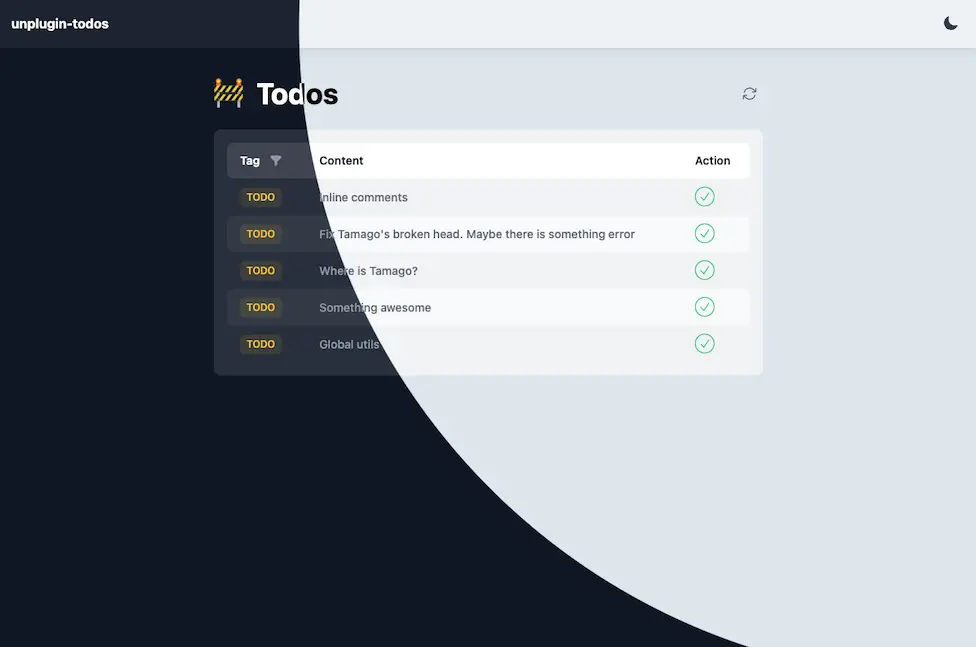

# unplugin-todos

📋 A universal bundler plugin for generate a task schedule from code comments, powered by [unplugin](https://github.com/unjs/unplugin).

## Features

🌓 Friendly todo list with light / dark mode.

📝 Dynamic generate list from code comments.

🏷 Support tag filters.

🖊️ Enable to change the comment tags on ui.

📦 Support common bundlers.



## Installation

```bash
# npm
npm i -D unplugin-todos
```

## Usage

<details>
<summary>Vite</summary><br>

```ts
// vite.config.ts
import Todos from 'unplugin-todos'

export default defineConfig({
  plugins: [Todos.vite()],
})
```

<br></details>

<details>
<summary>Rollup</summary><br>

```ts
// rollup.config.js
import Todos from 'unplugin-todos'

export default {
  plugins: [Todos.rollup()],
}
```

<br></details>

<details>
<summary>esbuild</summary><br>

```ts
// esbuild.config.js
import { build } from 'esbuild'

build({
  plugins: [require('unplugin-todos').esbuild()],
})
```

<br></details>

<details>
<summary>Webpack</summary><br>

```ts
// webpack.config.js
module.exports = {
  /* ... */
  plugins: [require('unplugin-todos').webpack()],
}
```

<br></details>

## Playground

See [playground](./playground)

## Options

### `options.dev`

- Type: `boolean`
- Default: `true`

### `options.includes`

- Type: `string[]`
- Default: `[]`

## License

[MIT](./LICENSE) License © 2024-PRESENT [Tamago](https://github.com/tmg0)
